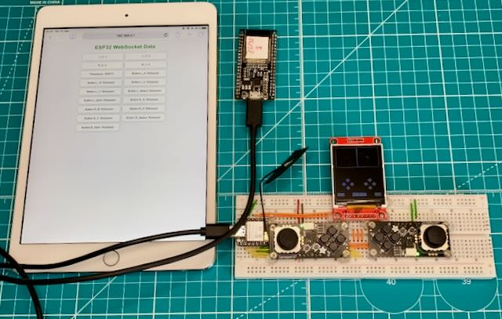

# ESP32 Debug Monitor

This repository contains firmware for a **dedicated ESP32-S3-based debug monitor**, designed to serve as an auxiliary component within a larger modular robotics system. Its role is to provide **real-time visualization and diagnostics** of data sent by the remote control **Pad** and the **Mecanum platform**.

It functions as an external **TFT-based monitoring hub**, offering a more spacious and detailed display compared to the onboard TFT of the Pad. Data is received via **ESP-NOW** and visualized live using a built-in **WebSocket web interface**.

## Main Features
- Receives structured ESP-NOW messages from the Pad
- Parses joystick and button states
- Hosts a local WebSocket web interface at `192.168.4.1`
- Displays live telemetry data at ~50Hz
- Works as a standalone diagnostic tool

---

## Components Used

| Part Description               | Model / Notes                          | Quantity |
|-------------------------------|----------------------------------------|----------|
| Microcontroller Board         | ESP32-S3 DevKitC                       | 1        |

## Web Interface

The device hosts a Wi-Fi Access Point named `ESP32-Network` (password: `12345678`). Once connected, navigate to [http://192.168.4.1](http://192.168.4.1) to open the WebSocket UI.

The page will show:
- Joystick values (L_X, L_Y, R_X, R_Y)
- Button states (Pressed / Released)
- Message count and timestamp

---

## Roadmap – Debug Monitor (ESP32-S3)

### Stage 1 – MVP: Basic Data Receiver
- [x] Receive ESP-NOW messages from Pad
- [x] Parse message structure into local variables
- [x] Launch AP + WebSocket server
- [x] Visualize joystick and button states on HTML page

### Stage 2 – Extended Pad Support
- [ ] Display raw joystick values (ADC level)
- [ ] Include additional Pad parameters (RSSI, MAC)
- [ ] Add message integrity indicators (lost packets, CRC)

### Stage 3 – Platform Diagnostics
- [ ] Receive data from Mecanum platform (battery, faults)
- [ ] Display platform error codes or warnings
- [ ] Design separate tab/page for platform state

### Stage 4 – Performance Monitoring
- [ ] Add live plotting using JavaScript (e.g., joystick movement over time)
- [ ] Implement logging to SPIFFS/SD
- [ ] Toggle debug verbosity levels (info/warn/error)

---

## Notes
- This debug monitor is **not essential** for running the Pad or Platform but is **extremely useful** for visual inspection and live feedback during development and testing.
- It serves as a high-level dashboard in the development cycle.
- Can be later integrated with the ROS2 telemetry bridge.

---

## License
This project is licensed under the **GNU General Public License v3.0**. See the [LICENSE](LICENSE) file for details.

